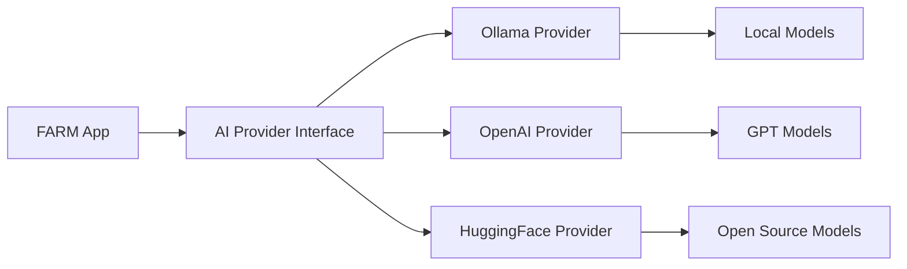

# AI/ML Integration

FARM provides first-class AI support with a unified provider abstraction layer. Seamlessly switch between local development with Ollama and production deployments with OpenAI, Anthropic, or HuggingFace.

<Callout type="success" title="AI-First Architecture">
  Built-in GPU support, model inference, streaming responses, and ML pipeline
  integration out of the box.
</Callout>

## Provider Architecture

The AI system uses a provider pattern that allows transparent switching between different AI services:



## Backend Integration

### Multi-Provider Setup

<CodeTabs examples={[
  {
    language: "python",
    label: "Provider Configuration", 
    code: `# farm.config.ts
export default defineConfig({
  ai: {
    provider: 'ollama', // 'ollama' | 'openai' | 'anthropic' | 'huggingface'
    models: ['llama3.2', 'codellama'],
    fallback: 'openai', // Fallback provider
    settings: {
      temperature: 0.7,
      maxTokens: 1000,
      streaming: true
    }
  }
});`
  },
  {
    language: "python",
    label: "Python Backend",
    code: `# Multi-provider AI integration
from farm.ai import AIProvider, ChatMessage

# Get configured provider (Ollama in dev, OpenAI in prod)

provider = AIProvider.get_default()

@app.post("/chat")
async def chat_endpoint(request: ChatRequest):
response = await provider.chat([
ChatMessage(role="user", content=request.message)
], model=request.model or "llama3.2")

    return {"response": response}

# Streaming chat endpoint

@app.post("/chat/stream")
async def streaming_chat(request: ChatRequest):
async def generate():
async for chunk in provider.stream_chat(
request.messages,
model=request.model
):
yield f"data: {chunk.json()}\\n\\n"

    return StreamingResponse(generate(), media_type="text/plain")`

}
]} />

### Provider-Specific Usage

<CodeTabs examples={[
  {
    language: "python",
    label: "Ollama (Local)",
    code: `# Ollama provider for local development
from farm.ai import OllamaProvider

ollama = OllamaProvider()

# Chat completion

response = await ollama.chat([
ChatMessage(role="user", content="Hello!")
], model="llama3.2")

# Check available models

models = await ollama.list_models()
print([model.name for model in models])

# Pull new model

await ollama.pull_model("codellama")`  },
  {
    language: "python", 
    label: "OpenAI (Production)",
    code:`# OpenAI provider for production
from farm.ai import OpenAIProvider

openai = OpenAIProvider(api_key=os.getenv("OPENAI_API_KEY"))

# Chat completion

response = await openai.chat([
ChatMessage(role="user", content="Hello!")
], model="gpt-4")

# Function calling

response = await openai.chat(
messages=[ChatMessage(role="user", content="What's the weather?")],
functions=[get_weather_function],
model="gpt-4"
)`
}
]} />

## Frontend Integration

### React Hooks

FARM provides type-safe React hooks for AI operations:

<CodeTabs examples={[
  {
    language: "typescript",
    label: "Streaming Chat",
    code: `import { useStreamingChat, useAIModels } from "@farm/ai-hooks";

function ChatComponent() {
const {
messages,
sendMessage,
isStreaming,
error
} = useStreamingChat({
provider: "ollama", // Auto-switches based on environment
model: "llama3.2",
onMessage: (message) => {
console.log("New message:", message);
},
onError: (error) => {
console.error("Chat error:", error);
}
});

const { data: models, isLoading } = useAIModels("ollama");

return (
<div className="chat-container">
<ModelSelector 
        models={models} 
        loading={isLoading}
        onChange={setSelectedModel}
      />
<ChatMessages messages={messages} />
<ChatInput
onSend={sendMessage}
disabled={isStreaming}
placeholder={isStreaming ? "AI is typing..." : "Type a message..."}
/>
{error && <ErrorBanner error={error} />}
</div>
);
}`  },
  {
    language: "typescript",
    label: "AI Completion",
    code:`import { useAICompletion, useAIHealth } from "@farm/ai-hooks";

function CodeEditor() {
const {
complete,
completion,
isLoading
} = useAICompletion({
provider: "ollama",
model: "codellama"
});

const { data: health } = useAIHealth();

const handleCompletion = async (prompt: string) => {
const result = await complete({
prompt,
maxTokens: 500,
temperature: 0.2
});
return result;
};

return (
<div>
<div className="status">
Ollama: {health?.ollama?.status}
OpenAI: {health?.openai?.status}  
 </div>
<CodeMirror 
        onComplete={handleCompletion}
        completion={completion}
        loading={isLoading}
      />
</div>
);
}`
}
]} />

### WebSocket Streaming

For real-time AI responses, FARM provides WebSocket integration:

<CodeTabs examples={[
  {
    language: "typescript",
    label: "WebSocket Client",
    code: `import { useAIWebSocket } from "@farm/ai-hooks";

function RealtimeChat() {
const {
sendMessage,
messages,
connectionStatus,
lastMessage
} = useAIWebSocket({
url: "/ws/chat",
provider: "ollama",
model: "llama3.2"
});

useEffect(() => {
if (lastMessage?.type === "ai_response") {
// Handle streaming AI response
console.log("AI:", lastMessage.content);
}
}, [lastMessage]);

return (
<div>
<ConnectionStatus status={connectionStatus} />
<ChatWindow messages={messages} />
<MessageInput onSend={sendMessage} />
</div>
);
}`  },
  {
    language: "python",
    label: "WebSocket Backend", 
    code:`from fastapi import WebSocket
from farm.ai import AIProvider

@app.websocket("/ws/chat")
async def websocket_chat(websocket: WebSocket):
await websocket.accept()
provider = AIProvider.get_default()

    try:
        while True:
            # Receive message from client
            data = await websocket.receive_json()
            message = data["message"]

            # Stream AI response
            async for chunk in provider.stream_chat([
                ChatMessage(role="user", content=message)
            ], model="llama3.2"):
                await websocket.send_json({
                    "type": "ai_response",
                    "content": chunk.content,
                    "done": chunk.done
                })

    except WebSocketDisconnect:
        print("Client disconnected")`

}
]} />

## Local Development with Ollama

### Automatic Model Management

<Step number={1} title="Configuration">

Configure models in your `farm.config.ts`:

```typescript
export default defineConfig({
  ai: {
    provider: "ollama",
    models: ["llama3.2", "codellama", "llama3.2-vision"],
    autoStart: true, // Start Ollama with dev server
    pullOnStart: true, // Download models if missing
  },
});
```

</Step>

<Step number={2} title="Development Server">

Start development with automatic Ollama setup:

```bash
farm dev
# ✓ Starting Ollama service...
# ✓ Pulling llama3.2...
# ✓ Pulling codellama...
# ✓ Models ready for inference
# ✓ Frontend: http://localhost:3000
# ✓ Backend: http://localhost:8000
# ✓ Ollama: http://localhost:11434
```

</Step>

### GPU Detection & Configuration

<FeatureList
  features={[
    {
      name: "Automatic GPU Detection",
      description:
        "Framework detects available NVIDIA GPUs and configures Ollama accordingly",
      icon: "🎯",
    },
    {
      name: "Memory Management",
      description: "Intelligent GPU memory allocation across multiple models",
      icon: "🧠",
    },
    {
      name: "CPU Fallback",
      description: "Graceful degradation to CPU when GPU unavailable",
      icon: "🔄",
    },
    {
      name: "Model Hot-Swap",
      description: "Update ML models without server restart",
      icon: "🔥",
    },
  ]}
/>

## Production Deployment

### Environment-Based Provider Switching

<CodeTabs examples={[
  {
    language: "typescript",
    label: "Environment Config",
    code: `// farm.config.ts
export default defineConfig({
  ai: {
    // Development: Use Ollama locally
    provider: process.env.NODE_ENV === 'development' ? 'ollama' : 'openai',
    
    // Production: Use OpenAI
    openai: {
      apiKey: process.env.OPENAI_API_KEY,
      organization: process.env.OPENAI_ORG_ID
    },
    
    // Fallback configuration
    fallback: {
      provider: 'anthropic',
      apiKey: process.env.ANTHROPIC_API_KEY
    }
  }
});`
  },
  {
    language: "python",
    label: "Provider Routing",
    code: `# Automatic provider routing
provider = AIProvider.get_default()  # Returns correct provider for environment

# Manual provider selection

if os.getenv("AI_PROVIDER") == "openai":
provider = AIProvider.get("openai")
elif os.getenv("AI_PROVIDER") == "anthropic":
provider = AIProvider.get("anthropic")
else:
provider = AIProvider.get("ollama") # Default to local`
}
]} />

### Deployment Configurations

<CodeTabs examples={[
  {
    language: "yaml",
    label: "Docker Compose",
    code: `# docker-compose.yml
version: '3.8'
services:
  api:
    build: ./apps/api
    environment:
      - AI_PROVIDER=openai
      - OPENAI_API_KEY=\${OPENAI_API_KEY}
    depends_on:
      - mongodb

web:
build: ./apps/web
environment: - VITE_API_URL=http://api:8000 - VITE_AI_PROVIDER=openai

# Ollama service for local development

ollama:
image: ollama/ollama:latest
ports: - "11434:11434"
volumes: - ollama_data:/root/.ollama
profiles: - development`  },
  {
    language: "yaml", 
    label: "Kubernetes",
    code:`# k8s-deployment.yml
apiVersion: apps/v1
kind: Deployment
metadata:
name: farm-api
spec:
template:
spec:
containers: - name: api
image: farm-api:latest
env: - name: AI_PROVIDER
value: "openai" - name: OPENAI_API_KEY
valueFrom:
secretKeyRef:
name: ai-secrets
key: openai-api-key`
}
]} />

## Advanced Features

### Function Calling

<CodeTabs examples={[
  {
    language: "python",
    label: "Backend Functions",
    code: `from farm.ai import function_definition

@function_definition
async def get_weather(location: str, unit: str = "celsius") -> dict:
"""Get current weather for a location.""" # Your weather API integration
return {"temperature": 22, "condition": "sunny"}

@app.post("/chat/functions")
async def chat_with_functions(request: ChatRequest):
provider = AIProvider.get_default()

    response = await provider.chat(
        messages=request.messages,
        functions=[get_weather],
        model="gpt-4"
    )

    return response`

},
{
language: "typescript",
label: "Frontend Integration",
code: `import { useFunctionCalling } from "@farm/ai-hooks";

function WeatherChat() {
const {
sendMessage,
messages,
isLoading
} = useFunctionCalling({
provider: "openai",
model: "gpt-4",
functions: ["get_weather", "get_forecast"],
onFunctionCall: (name, args, result) => {
console.log(\`Function \${name} called with\`, args, \`result:\`, result);
}
});

return (
<ChatInterface 
      messages={messages}
      onSend={sendMessage}
      loading={isLoading}
      showFunctionCalls={true}
    />
);
}`
}
]} />

### Vector Operations

<CodeTabs examples={[
  {
    language: "python",
    label: "Embeddings & Search",
    code: `from farm.ai import EmbeddingProvider
from farm.database import VectorIndex

# Generate embeddings

embedding_provider = EmbeddingProvider.get_default()
embeddings = await embedding_provider.embed([
"Document content 1",
"Document content 2"
])

# Vector search with MongoDB

vector_index = VectorIndex("documents")
results = await vector_index.search(
query_embedding=embeddings[0],
limit=10,
threshold=0.8
)

# Hybrid search (text + vector)

hybrid_results = await vector_index.hybrid_search(
text_query="machine learning",
vector_query=embeddings[0],
weights={"text": 0.3, "vector": 0.7}
)`
}
]} />

<Warning>
  Vector operations require MongoDB Atlas or a local MongoDB instance with
  vector search enabled.
</Warning>

## Performance & Monitoring

### AI Health Monitoring

<CodeTabs examples={[
  {
    language: "python",
    label: "Health Checks",
    code: `from farm.ai import AIHealthMonitor

@app.get("/health/ai")
async def ai_health():
monitor = AIHealthMonitor()

    return {
        "ollama": await monitor.check_ollama(),
        "openai": await monitor.check_openai(),
        "models": await monitor.list_available_models(),
        "gpu": await monitor.gpu_status()
    }`

},
{
language: "typescript",
label: "Frontend Monitoring",
code: `import { useAIHealth } from "@farm/ai-hooks";

function AIStatusDashboard() {
const { data: health, refetch } = useAIHealth({
refetchInterval: 30000 // Check every 30 seconds
});

return (
<div className="ai-status">
<StatusCard 
        title="Ollama"
        status={health?.ollama?.status}
        models={health?.ollama?.models}
      />
<StatusCard
        title="OpenAI" 
        status={health?.openai?.status}
        quota={health?.openai?.quota}
      />
<GPUCard gpu={health?.gpu} />
</div>
);
}`
}
]} />

<Info>
  FARM automatically monitors AI provider health and provides detailed metrics
  for debugging and optimization.
</Info>
