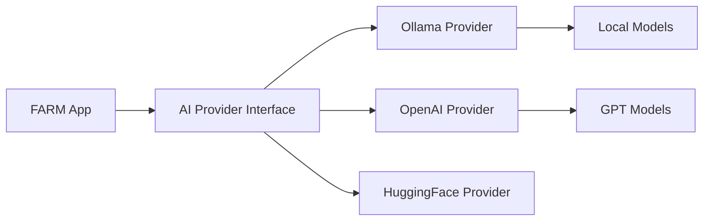

# AI/ML Integration

FARM provides first-class AI support with a unified provider abstraction layer. Seamlessly switch between local development with Ollama and production deployments with OpenAI, Anthropic, or HuggingFace.

<Callout type="success" title="AI-First Architecture">
  Built-in GPU support, model inference, streaming responses, and ML pipeline
  integration out of the box.
</Callout>

## Provider Architecture

The AI system uses a provider pattern that allows transparent switching between different AI services:

// ...existing code for the rest of the AI integration doc...
