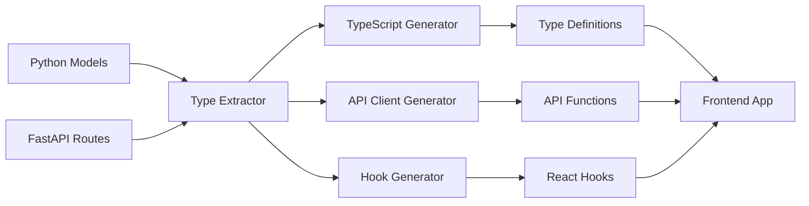

# Code Generation Pipeline

FARM's intelligent code generation system automatically converts Python backend models into TypeScript types, API clients, React hooks, and complete CRUD interfaces. This ensures end-to-end type safety and eliminates manual client code maintenance.

<Callout type="success" title="Zero Configuration">
  Type generation happens automatically during development and builds, keeping
  frontend and backend perfectly synchronized.
</Callout>

## Architecture Overview



## Automatic Type Generation

### From Python Models to TypeScript

<CodeTabs examples={[
  {
    language: "python",
    label: "Python Model",
    code: `from beanie import Document
from farm.database import Field
from typing import Optional, List
from datetime import datetime
from enum import Enum

class UserRole(str, Enum):
ADMIN = "admin"
USER = "user"
MODERATOR = "moderator"

class User(Document):
name: str = Field(..., description="User's full name")
email: str = Field(..., unique=True, description="Email address")
age: Optional[int] = Field(None, ge=18, le=120)
role: UserRole = Field(default=UserRole.USER)
preferences: dict = Field(default_factory=dict)
tags: List[str] = Field(default_factory=list)
created_at: datetime = Field(default_factory=datetime.utcnow)
is_active: bool = Field(default=True)

    class Settings:
        collection = "users"`

},
{
language: "typescript",
label: "Generated TypeScript",
code: `// Auto-generated from Python models
export enum UserRole {
ADMIN = "admin",
USER = "user",
MODERATOR = "moderator"
}

export interface User {
  id: string;
  name: string;
  email: string;
  age?: number;
  role: UserRole;
  preferences: Record<string, any>;
  tags: string[];
  created_at: Date;
  is_active: boolean;
}

export interface CreateUserRequest {
  name: string;
  email: string;
  age?: number;
  role?: UserRole;
  preferences?: Record<string, any>;
  tags?: string[];
}

export interface UpdateUserRequest {
  name?: string;
  email?: string;
  age?: number;
  role?: UserRole;
  preferences?: Record<string, any>;
  tags?: string[];
  is_active?: boolean;
}`
  }
]} />

### API Route Generation

<CodeTabs examples={[
  {
    language: "python",
    label: "FastAPI Endpoints",
    code: `from fastapi import APIRouter, HTTPException, Depends
from farm.api import auto_crud, paginate
from typing import List

router = APIRouter(prefix="/api/users", tags=["users"])

# Auto-generate CRUD endpoints

auto_crud(User, router=router, exclude=["delete"])

# Custom endpoints

@router.get("/search")
async def search_users(
query: str,
role: Optional[UserRole] = None,
page: int = 1,
limit: int = 20
) -> PaginatedResponse[User]:
filters = {}
if role:
filters["role"] = role

    users = await User.find(
        User.name.regex(query, "i") if query else {},
        **filters
    )

    return await paginate(users, page=page, limit=limit)

@router.post("/{user_id}/activate")
async def activate_user(user_id: str) -> User:
user = await User.get(user_id)
if not user:
raise HTTPException(404, "User not found")

    user.is_active = True
    await user.save()
    return user`

},
{
language: "typescript",
label: "Generated API Client",
code: `// Auto-generated API client
export class UserService {
private static baseUrl = process.env.VITE_API_URL + "/api/users";

// CRUD operations
static async list(params?: {
page?: number;
limit?: number;
role?: UserRole;
}): Promise<PaginatedResponse<User>> {
const query = new URLSearchParams(params as any).toString();
const response = await fetch(\`\${this.baseUrl}?\${query}\`);
return response.json();
}

static async get(id: string): Promise<User> {
const response = await fetch(\`\${this.baseUrl}/\${id}\`);
if (!response.ok) throw new Error("User not found");
return response.json();
}

static async create(data: CreateUserRequest): Promise<User> {
const response = await fetch(this.baseUrl, {
method: "POST",
headers: { "Content-Type": "application/json" },
body: JSON.stringify(data)
});
if (!response.ok) throw new Error("Failed to create user");
return response.json();
}

static async update(id: string, data: UpdateUserRequest): Promise<User> {
const response = await fetch(\`\${this.baseUrl}/\${id}\`, {
method: "PATCH",
headers: { "Content-Type": "application/json" },
body: JSON.stringify(data)
});
if (!response.ok) throw new Error("Failed to update user");
return response.json();
}

// Custom endpoints
static async search(params: {
query: string;
role?: UserRole;
page?: number;
limit?: number;
}): Promise<PaginatedResponse<User>> {
const query = new URLSearchParams(params as any).toString();
const response = await fetch(\`\${this.baseUrl}/search?\${query}\`);
return response.json();
}

static async activate(id: string): Promise<User> {
const response = await fetch(\`\${this.baseUrl}/\${id}/activate\`, {
method: "POST"
});
if (!response.ok) throw new Error("Failed to activate user");
return response.json();
}
}`
}
]} />

## React Hook Generation

### Generated Hooks

<CodeTabs examples={[
  {
    language: "typescript",
    label: "Query Hooks",
    code: `// Auto-generated React hooks using TanStack Query
import { useQuery, useMutation, useQueryClient } from '@tanstack/react-query';
import { UserService } from '@/services/UserService';

export function useUsers(params?: {
  page?: number;
  limit?: number;
  role?: UserRole;
}) {
  return useQuery({
    queryKey: ['users', params],
    queryFn: () => UserService.list(params),
    keepPreviousData: true,
    staleTime: 5 * 60 * 1000, // 5 minutes
  });
}

export function useUser(id: string) {
  return useQuery({
    queryKey: ['users', id],
    queryFn: () => UserService.get(id),
    enabled: !!id,
  });
}

export function useUserSearch(query: string, options?: {
  role?: UserRole;
  page?: number;
  limit?: number;
}) {
  return useQuery({
    queryKey: ['users', 'search', query, options],
    queryFn: () => UserService.search({ query, ...options }),
    enabled: query.length > 2,
    debounce: 300,
  });
}`
  },
  {
    language: "typescript",
    label: "Mutation Hooks",
    code: `export function useCreateUser() {
  const queryClient = useQueryClient();
  
  return useMutation({
    mutationFn: UserService.create,
    onSuccess: (newUser) => {
      // Invalidate and refetch users list
      queryClient.invalidateQueries(['users']);
      
      // Add to cache
      queryClient.setQueryData(['users', newUser.id], newUser);
    },
    onError: (error) => {
      console.error('Failed to create user:', error);
    }
  });
}

export function useUpdateUser() {
  const queryClient = useQueryClient();
  
  return useMutation({
    mutationFn: ({ id, ...data }: { id: string } & UpdateUserRequest) =>
      UserService.update(id, data),
    onSuccess: (updatedUser) => {
      // Update cached user
      queryClient.setQueryData(['users', updatedUser.id], updatedUser);
      
      // Invalidate lists that might contain this user
      queryClient.invalidateQueries(['users'], { exact: false });
    }
  });
}

export function useActivateUser() {
  const queryClient = useQueryClient();
  
  return useMutation({
    mutationFn: UserService.activate,
    onSuccess: (user) => {
      queryClient.setQueryData(['users', user.id], user);
      queryClient.invalidateQueries(['users']);
    }
  });
}`
  }
]} />

### Hook Usage in Components

<CodeTabs examples={[
  {
    language: "typescript",
    label: "List Component",
    code: `import { useUsers, useUserSearch } from '@/hooks/useUsers';
import { UserRole } from '@/types/User';

function UserList() {
const [searchQuery, setSearchQuery] = useState('');
const [selectedRole, setSelectedRole] = useState<UserRole>();
const [page, setPage] = useState(1);

// Use search when query exists, otherwise list all
const {
data: searchResults,
isLoading: isSearching
} = useUserSearch(searchQuery, { role: selectedRole, page });

const {
data: allUsers,
isLoading: isLoadingAll
} = useUsers({ role: selectedRole, page });

const data = searchQuery ? searchResults : allUsers;
const isLoading = searchQuery ? isSearching : isLoadingAll;

return (
<div>
<div className="filters">
<SearchInput
          value={searchQuery}
          onChange={setSearchQuery}
          placeholder="Search users..."
        />
<RoleFilter
          value={selectedRole}
          onChange={setSelectedRole}
        />
</div>

      {isLoading ? (
        <UserListSkeleton />
      ) : (
        <div>
          {data?.items.map(user => (
            <UserCard key={user.id} user={user} />
          ))}
          <Pagination
            current={page}
            total={data?.total || 0}
            pageSize={data?.limit || 20}
            onChange={setPage}
          />
        </div>
      )}
    </div>

);
}`  },
  {
    language: "typescript",
    label: "Form Component",
    code:`import { useCreateUser, useUpdateUser } from '@/hooks/useUsers';
import { useForm } from 'react-hook-form';

interface UserFormProps {
user?: User;
onSuccess?: () => void;
}

function UserForm({ user, onSuccess }: UserFormProps) {
const isEditing = !!user;

const createUser = useCreateUser();
const updateUser = useUpdateUser();

const form = useForm<CreateUserRequest>({
defaultValues: user ? {
name: user.name,
email: user.email,
age: user.age,
role: user.role,
tags: user.tags
} : {
role: UserRole.USER,
tags: []
}
});

const onSubmit = async (data: CreateUserRequest) => {
try {
if (isEditing) {
await updateUser.mutateAsync({ id: user.id, ...data });
} else {
await createUser.mutateAsync(data);
}
onSuccess?.();
} catch (error) {
// Error handling is done in the hooks
}
};

return (
<form onSubmit={form.handleSubmit(onSubmit)}>
<Input
{...form.register('name', { required: 'Name is required' })}
label="Name"
error={form.formState.errors.name?.message}
/>

      <Input
        {...form.register('email', { required: 'Email is required' })}
        type="email"
        label="Email"
        error={form.formState.errors.email?.message}
      />

      <NumberInput
        {...form.register('age', { min: 18, max: 120 })}
        label="Age"
        error={form.formState.errors.age?.message}
      />

      <Select
        {...form.register('role')}
        label="Role"
        options={Object.values(UserRole)}
      />

      <TagInput
        {...form.register('tags')}
        label="Tags"
      />

      <Button
        type="submit"
        loading={createUser.isLoading || updateUser.isLoading}
      >
        {isEditing ? 'Update' : 'Create'} User
      </Button>
    </form>

);
}`
}
]} />

## CLI Code Generation

### Generate Commands

<CodeTabs examples={[
  {
    language: "bash",
    label: "Model Generation",
    code: `# Generate complete model with API and frontend
farm generate model Product

# Generate with specific features

farm generate model Product --api --hooks --forms

# Generate from existing database

farm generate model --from-db products`  },
  {
    language: "bash",
    label: "Page Generation",
    code:`# Generate CRUD pages for existing model
farm generate page users

# Generate with specific layout

farm generate page users --layout dashboard

# Generate with custom components

farm generate page users --components table,form,filters`
}
]} />

### Generated File Structure

When you run `farm generate model Product`, it creates:

```
📁 Backend (Python)
├── apps/api/src/models/product.py
├── apps/api/src/routes/products.py
└── apps/api/tests/test_products.py

📁 Frontend (TypeScript)
├── apps/web/src/types/Product.ts
├── apps/web/src/services/ProductService.ts
├── apps/web/src/hooks/useProducts.ts
└── apps/web/src/components/ProductForm.tsx

📁 Generated Pages (Optional)
├── apps/web/src/pages/products/index.tsx
├── apps/web/src/pages/products/[id].tsx
└── apps/web/src/pages/products/create.tsx
```

### Custom Templates

<CodeTabs examples={[
  {
    language: "typescript",
    label: "Custom Template",
    code: `// templates/custom-model.template.ts
export const customModelTemplate = {
  python: \`
from beanie import Document
from farm.database import Field
from typing import {{ imports }}

class {{ ModelName }}(Document):
{{ fields }}

    class Settings:
        collection = "{{ collection_name }}"
        {{ settings }}

\`,

typescript: \`
export interface {{ ModelName }} {
{{ fields }}
}

export interface Create{{ ModelName }}Request {
  {{ create_fields }}
}
  \`,
  
  hooks: \`
export function use{{ ModelName }}s() {
  return useQuery({
    queryKey: ['{{ model_name }}s'],
    queryFn: {{ ModelName }}Service.list
  });
}
  \`
};`
  },
  {
    language: "bash",
    label: "Use Custom Template",
    code: `# Use custom template
farm generate model Product --template custom-model

# Generate from URL template

farm generate model Product --template https://github.com/user/farm-templates/model.json`
}
]} />

## Configuration & Customization

### Generation Settings

<CodeTabs
  examples={[
    {
      language: "typescript",
      label: "farm.config.ts",
      code: `export default defineConfig({
  codegen: {
    // Output directories
    output: {
      types: 'apps/web/src/types',
      services: 'apps/web/src/services',
      hooks: 'apps/web/src/hooks'
    },
    
    // Generation options
    typescript: {
      enumFormat: 'union', // 'union' | 'enum'
      dateFormat: 'Date', // 'Date' | 'string'
      optionalFormat: 'partial', // 'partial' | 'required'
      includeDocstrings: true
    },
    
    // Hook generation
    hooks: {
      library: 'tanstack-query', // 'tanstack-query' | 'swr'
      errorBoundary: true,
      suspense: false,
      devtools: true
    },
    
    // API client
    client: {
      baseUrl: process.env.VITE_API_URL,
      timeout: 10000,
      retries: 3,
      interceptors: true
    }
  }
});`,
    },
  ]}
/>

### Watch Mode

<CodeTabs examples={[
  {
    language: "bash",
    label: "Development Workflow",
    code: `# Start with automatic generation
farm dev --codegen

# Watch specific files

farm codegen watch --models --routes

# Manual generation

farm codegen generate

# Generate specific types

farm codegen generate --only types,hooks`
}
]} />

## Advanced Features

### Custom Type Mappings

<CodeTabs examples={[
  {
    language: "python",
    label: "Python Types",
    code: `from farm.codegen import TypeMapping
from decimal import Decimal
from uuid import UUID

# Custom type mappings

TypeMapping.register(Decimal, "number")
TypeMapping.register(UUID, "string")

# Custom field annotations

from typing import Annotated

UserId = Annotated[str, {"tsType": "string", "validation": "uuid"}]
Price = Annotated[Decimal, {"tsType": "number", "precision": 2}]

class Product(Document):
id: UserId
price: Price = Field(..., description="Product price in USD")`  },
  {
    language: "typescript",
    label: "Generated Result",
    code:`// Generated with custom mappings
export interface Product {
id: string; // UUID validation
price: number; // Decimal with 2 precision
}

// Generated validation
export const ProductSchema = z.object({
id: z.string().uuid(),
price: z.number().multipleOf(0.01)
});`
}
]} />

### Integration with OpenAPI

<CodeTabs examples={[
  {
    language: "python",
    label: "OpenAPI Integration",
    code: `# FastAPI automatically generates OpenAPI schema
from fastapi import FastAPI
from farm.codegen import generate_client_from_openapi

app = FastAPI(
title="FARM API",
description="Auto-generated API documentation",
version="1.0.0"
)

# Export OpenAPI schema

@app.get("/openapi.json")
async def get_openapi():
return app.openapi()

# Generate client from OpenAPI

await generate_client_from_openapi(
"http://localhost:8000/openapi.json",
output_dir="apps/web/src/generated"
)`
}
]} />

<Info>
  Code generation runs automatically during development and can be configured to
  run on file changes, ensuring your frontend always stays in sync with backend
  changes.
</Info>

## Best Practices

### Type Safety Guidelines

<FeatureList
  features={[
    {
      name: "Strict TypeScript",
      description: "Enable strict mode and proper type checking",
      icon: "🔒",
    },
    {
      name: "Validation Layers",
      description: "Use runtime validation for API boundaries",
      icon: "✅",
    },
    {
      name: "Error Handling",
      description: "Proper error types and handling strategies",
      icon: "🚨",
    },
    {
      name: "Documentation",
      description: "Generate docs from code comments",
      icon: "📝",
    },
  ]}
/>

<Warning>
  Generated code should not be manually edited. Make changes to the source
  Python models and regenerate to maintain consistency.
</Warning>
