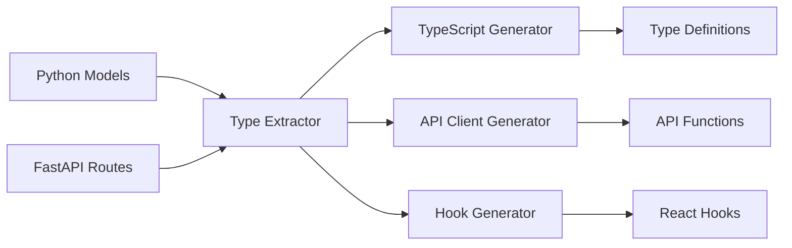

# Code Generation Pipeline

FARM's intelligent code generation system automatically converts Python backend models into TypeScript types, API clients, React hooks, and complete CRUD interfaces. This ensures end-to-end type safety and eliminates manual client code maintenance.

<Callout type="success" title="Zero Configuration">
  Type generation happens automatically during development and builds, keeping
  frontend and backend perfectly synchronized.
</Callout>

## Architecture Overview

// ...existing code for the rest of the code generation doc...
