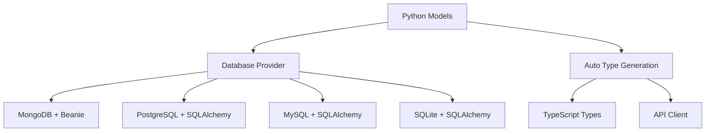

# Database Integration

FARM provides a flexible database layer with MongoDB as the primary choice, while supporting PostgreSQL, MySQL, and SQLite through a unified provider interface. The system features automatic type generation, migrations, and seamless ODM integration.

<Callout type="success" title="Database Agnostic">
  Start with MongoDB and switch to PostgreSQL or other databases without
  changing your application code.
</Callout>

## Database Architecture

// ...existing code for the rest of the database doc...
